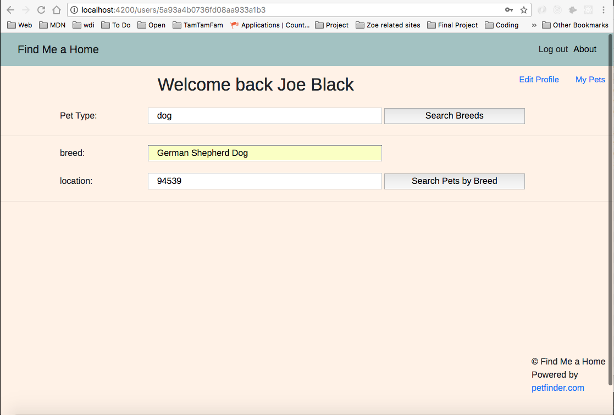

## Find Me a Home
Welcome to the 'Find Me a Home' App. It was created to help potential pet adopter to find a pet from animal shelters. The user can sign up/log in, then have the ability to do the following:
* search for breeds of animal by enter animal type(e.g. 'dog')
* search for all animals of the specified breed and location(e.g.'German Shepherd Dog' & 'zip code)
* the search results show the animal name, breed, age, sex, etc., along with the contact information for adoption
* add animals to his/her list of interest
* add comments for each animal
* dog is the only animal type supported in this first release

## Technologies Used
* MEAN stack
* Angular2/TypeScript for front-end
* Express/Node JS for back-end
* Mongo/Mongoose for DB
* Passport for user login/signup authentication
* Bcrypt for password encryption

## Installation Instructions
* git clone https://github.com/achentha/find-me-a-home.git
* cd find-me-a-home
* npm install
* npm start

## User Instructions
### 1. Sign Up
* From the home page, click on the 'Sign Up' link on the top right

###
* This bring you to the page with the Sign Up form

###
* Once you sign up, you will be logged in

### 2. Log in
* For the existing user, click on the 'Log in' link on the top right

### 3. After Sign Up/Log in, the user arrives at User page
#### 3.1 Search all dog breeds
* At this page, the user can search for all the dog breeds.
* Enter 'dog' in the 'Pet Type' input box
* Press 'Search Breeds' button
* This yields the list of all the 'Found Breeds'

#### 3.2 Search all available dogs for a specified breed
* Select one of 'Found Breeds' and enter it it the 'breed' input
* Enter the zip code in the 'location' input
* Press the 'Search Pets by Breed' button

####
* This yields all the available dogs of the specified breed from all the shelters in the nearby location

####
* From the pet list above, the user can select and add pets to his/her own list by clicking the 'Add to My List' button next to each dog

#### 3.3 Display all pets in the user's list
* From the pet list page above, click on the 'My Pets' link on the top right

####
* This yields all the pets the user has saved in his/her list

### 4. See more detail of a specific pet
* From the 'My Pets' page above, click on the "See More" button next to each pet
* This brings to a page of a specific dog which has more detail informations and photos(if provided from shelter)

### 5. Adding comments(notes) for each dog
* From the detail page of each pet above, scroll all the way down
* Click on the "Add Comment" button
* Enter comment in the input box and press the 'Create Comment' button
* This yields a simple form to input comment

###
* Now you can see the added comment at the bottom of the detail page of each pet
* You can enter as many comment entries as you want for each pet

## And then
* Once the user has gone thru all the steps above and decided to pick up a dog. He/she can reach the shelter based on the information of each pet.
* One more dog will find a good home. And one loving family can have a lovely dog.

## Acknowledgement/Credit
* Thanks to petfinder API which provides the access to their API to retrieve the information on the animals/shelters
* see https://www.petfinder.com for petfinder web site
* see https://www.petfinder.com/developers/api-docs for the API documentation

## History
11/01/2017 - Initial Creation
